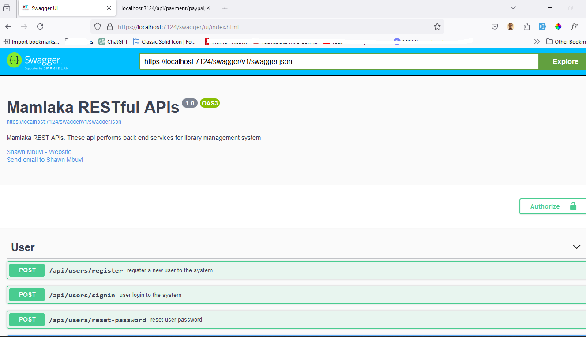
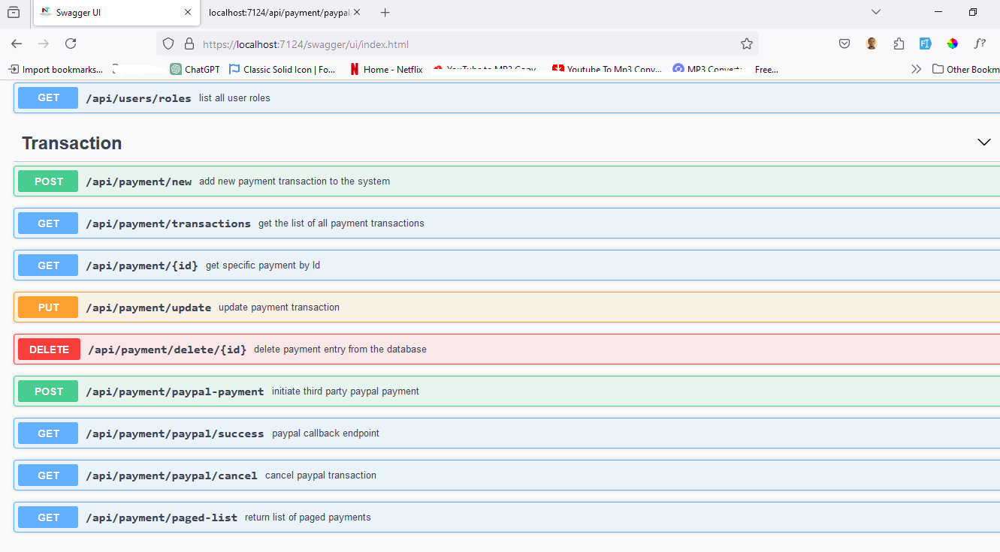
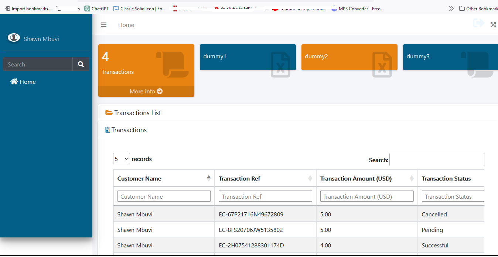

# This Project contains one solution
  ## 1. Mamlaka.API - BACK-END : contains all the endpoints as required from the document
  ## The endpoints are documented using xml, making it easy to comprehend and work with
    
# Notable technologies, frameworks and libraries used:
  ## a. .NET 8 Framework 
  ## b. .NET MVC 
  ## c. AutoMapper
  ## d. MySQL Server
  ## e. EF Core
  ## f. LINQ
  ## g. Docker, Git, Github
  ## h. JWT Bearer Authorization
  ## i. Paypal library
  ## j. Dapper
  ## k. Redis ORM

  ## The api project is on this git repository: https://github.com/Shawn72/mamlaka.interview.git  (master)
  ## The ui portal project is on this git repository: https://github.com/Shawn72/mamlaka.ui.git (master)

# clone the repository from github for testing. 
  ## Mamlaka.API ##
  ### Create file 'appsettings.Development' for use on local testing
  ### Go to 'launchSettings', change environment to 'development'
  ### Run the api using the 'Mamlaka.API.https' profile

 
  ### Approach used: Code-First-Approach
  ### > Clear up 'Migrations' folder - ready for fresh migrations
  ### > Clean and Build the solution
  ### > 'Add-Migration test-interview-migration'
  ### The migration creates all the necessary tables and also adds user roles

# Run the API to pull up swagger UI
## the followng url is launched: https://localhost:7124/swagger/ui/index.html
## access the endpoints using the above url
## to view transactions using the portal, launch the react (cloned from Mamlaka Ui repo, given above too) portal on port 3000, then use the user you have created to login

## use /api/users/register to create a new user for testing. give user role of 'SuperAdmin' to have all the rights
## after creating new user, use /api/users/signin to login and obtain the token (JWT) for Authorization.
## on the right hand corner, click on 'Authorize' button, the paste the JWT token obtained after sign in.
## now you will be able to hit the rest of endpoints without getting HTTP error 403

## the payments flow should START by initiating a Paypal transaction using endpoint 'api/transactions/paypal-payment'
## transaction is saved in database and after successful paypal processing, it's updated using token as the identifier.

### Swagger UI page

### Example of payment transactions list

